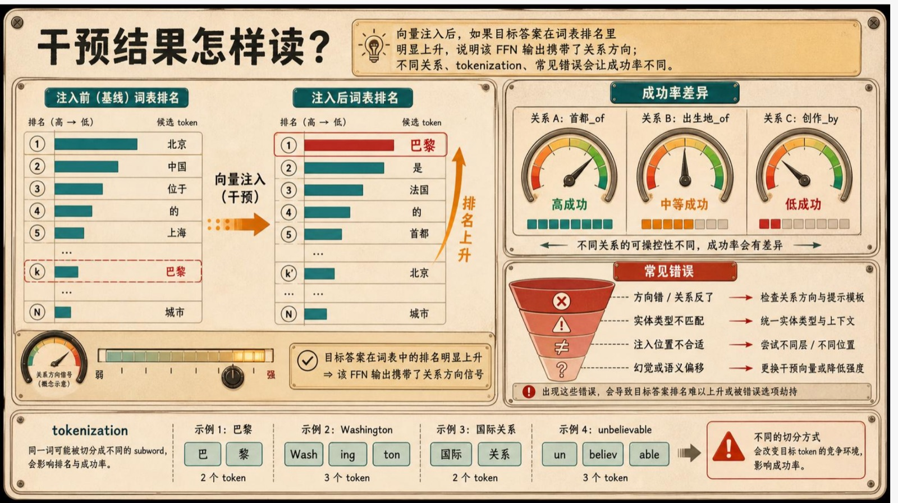
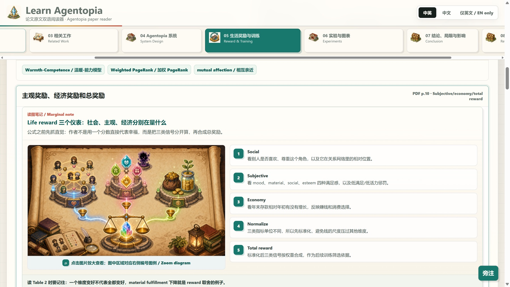
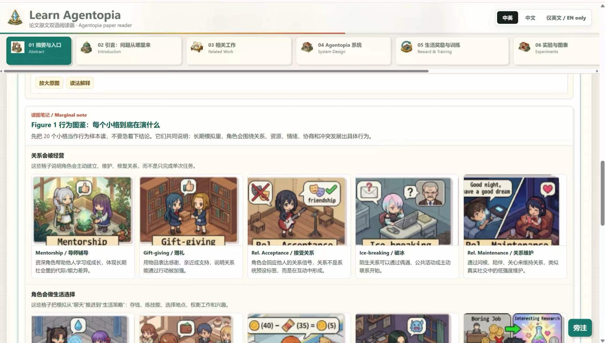
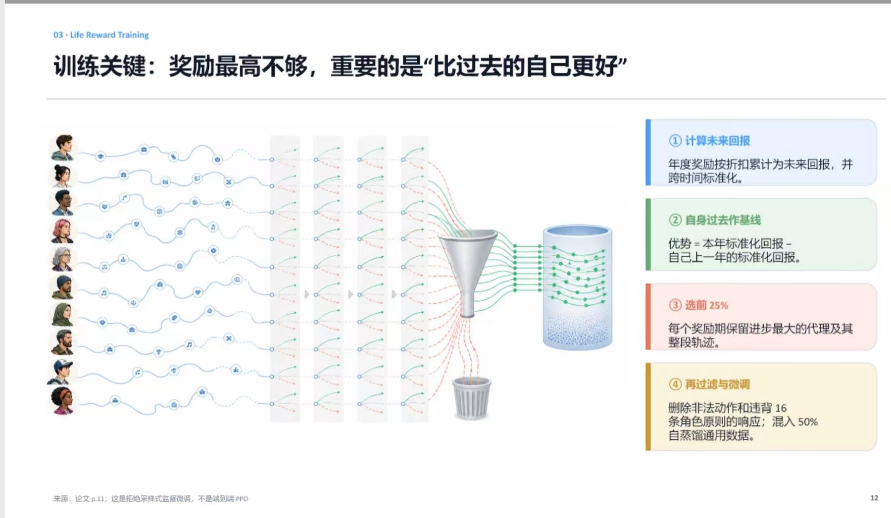
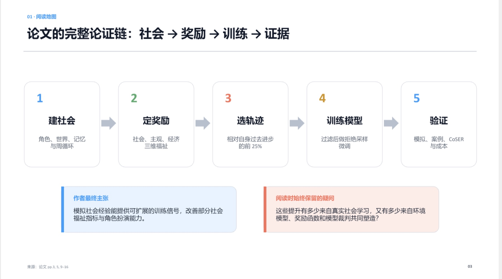
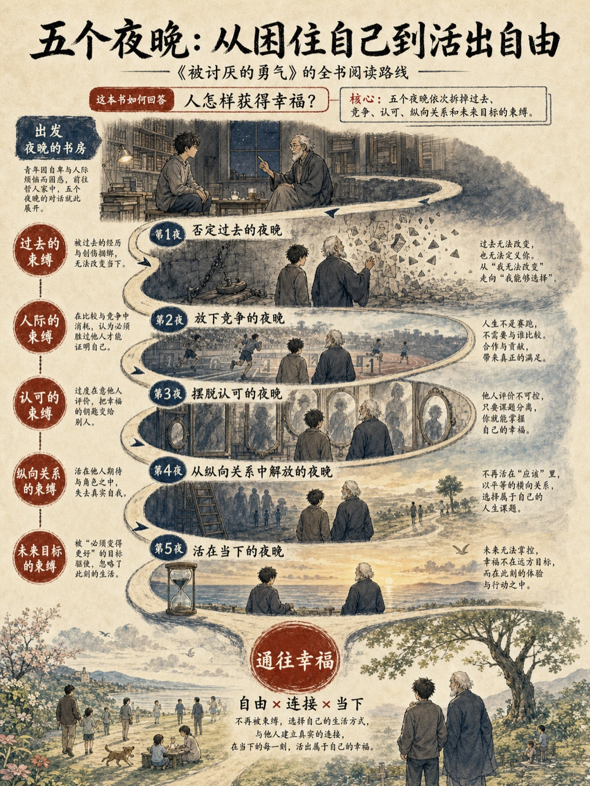

# Paper and Book to Visual Learning

> 把论文、书籍、文章等长文本，转化成可懂、看得清的视觉产品。

[](https://github.com/YIYANG-hakimide/paper-and-book-to-visual-learning/tags)
[](./SKILL.md)
[](./LICENSE)
[](https://yiyang-hakimide.github.io/paper-and-book-to-visual-learning/)
[](https://github.com/YIYANG-hakimide/paper-and-book-to-visual-learning/stargazers)

**Paper and Book to Visual Learning** 面向需要真正读懂长文本的人。它把论文、完整书籍、选定章节、文章、白皮书、研究报告和手册，整理成有清晰学习路径的视觉成品，同时保留关键概念、论证、证据与边界。

论文可视化、书籍学习图册、研究型 PPT 和双语互动阅读器，都由同一套教学逻辑生成。

| 学习图册 | 互动阅读器 |
| --- | --- |
| [](docs/assets/examples/paper-intervention-results.jpg) | [](docs/assets/examples/html-agentopia-reward-reader.jpg) |

在 Codex 中直接说：

```text
安装这个 Skill：https://github.com/YIYANG-hakimide/paper-and-book-to-visual-learning
```

[查看完整样张](https://yiyang-hakimide.github.io/paper-and-book-to-visual-learning/#examples-zh) · [提交想要视觉化的材料](https://github.com/YIYANG-hakimide/paper-and-book-to-visual-learning/issues/new?template=example-request.yml) · [报告问题](https://github.com/YIYANG-hakimide/paper-and-book-to-visual-learning/issues/new?template=bug-report.yml)

## 三种模式

- **图片（个人学习图册）**：把难点拆成连续、可独立阅读的讲解图，适合自学、复习与分享。可同时整理为按页浏览的 PDF 图册。
- **PPT（对外讲述，默认 PDF + 可编辑 PPTX）**：为汇报、教学和讨论组织完整叙事，让现场演示与会后阅读都能成立。
- **HTML（互动阅读器）**：把原文、中文导读、术语、图表和证据组织成可探索的阅读体验。

## 真实样例

### 论文转学习图册样张

|  |  |
| --- | --- |
| [](docs/assets/examples/paper-residual-stream.jpg) | [](docs/assets/examples/paper-intervention-results.jpg) |

### 书籍转学习图册样张

|  |  |
| --- | --- |
| [](docs/assets/examples/book-resilience.jpg) | [](docs/assets/examples/book-sleep-recovery.jpg) |

### 生成 HTML 样张

|  |  |
| --- | --- |
| [](docs/assets/examples/html-agentopia-figure-atlas.jpg) | [](docs/assets/examples/html-agentopia-reward-reader.jpg) |

### 生成 PPT 样张

|  |  |
| --- | --- |
| [](docs/assets/examples/ppt-agentopia-training.jpg) | [](docs/assets/examples/ppt-agentopia-argument-map.jpg) |

### 竖版视觉图样张

<p align="center">
  <a href="docs/assets/examples/visual-courage-reading-map-portrait.jpg"></a>
</p>

[查看完整《被讨厌的勇气》视觉学习图集 PDF](https://github.com/YIYANG-hakimide/paper-and-book-to-visual-learning/releases/download/v0.2.3/courage-visual-learning-album.pdf)

如果这个项目帮助你读懂了一篇材料，可以点一个 Star，让更多需要它的人更容易找到它。

## 安装与更新

推荐直接让 Codex 安装：

```text
安装这个 Skill：https://github.com/YIYANG-hakimide/paper-and-book-to-visual-learning
```

也可以使用 Codex 自带的 Skill 安装器：

```bash
python3 "${CODEX_HOME:-$HOME/.codex}/skills/.system/skill-installer/scripts/install-skill-from-github.py" \
  --repo YIYANG-hakimide/paper-and-book-to-visual-learning \
  --path . \
  --name paper-and-book-to-visual-learning
```

安装完成后，Skill 会从下一轮任务开始可用。

或使用 Git：

```bash
git clone https://github.com/YIYANG-hakimide/paper-and-book-to-visual-learning.git \
  ~/.codex/skills/paper-and-book-to-visual-learning
```

已有本地版本时更新：

```bash
git -C ~/.codex/skills/paper-and-book-to-visual-learning pull --ff-only
```

其他支持 Skill 的智能体平台也可以使用本仓库；请按对应平台的 Skill 目录或仓库导入方式安装，并确保平台具有可用的生图能力。

## 使用

在已支持 Skill 的智能体环境中调用 `paper-and-book-to-visual-learning`，提供来源文件或链接，并选择一种主要输出。

```text
用 $paper-and-book-to-visual-learning 帮我把这本书做成图片（个人学习图册），其余全部默认。
```

```text
用 $paper-and-book-to-visual-learning 把这篇论文做成 PPT（对外讲述，默认 PDF + 可编辑 PPTX），详细模式。
```

```text
用 $paper-and-book-to-visual-learning 把这份研究报告做成 HTML（互动阅读器）。
```

## 图像能力

图片图册和视觉化演示需要可用的图像生成能力。Codex 环境推荐使用系统提供的 `imagegen`；其他智能体平台需要连接可用的生图模型。不同平台的模型、权限与文件返回方式可能不同。

## 支持的来源

- 学术论文、研究报告与白皮书
- 完整书籍、选定章节与长篇文章
- 手册、教程和其他结构化长文本
- 本地 PDF、文档或可访问的网页来源

## 参与改进

- [提交案例需求](https://github.com/YIYANG-hakimide/paper-and-book-to-visual-learning/issues/new?template=example-request.yml)
- [报告运行或输出问题](https://github.com/YIYANG-hakimide/paper-and-book-to-visual-learning/issues/new?template=bug-report.yml)
- [提出功能建议](https://github.com/YIYANG-hakimide/paper-and-book-to-visual-learning/issues/new?template=feature-request.yml)
- [查看贡献说明](.github/CONTRIBUTING.md)

## English

> Turn papers, books, articles, and other long-form sources into visual products that are easier to understand and see clearly.

**Paper and Book to Visual Learning** is for readers who want to understand a source rather than skim a summary. It transforms papers, full books, selected chapters, articles, white papers, reports, and manuals into guided visual outputs while preserving the concepts, argument, evidence, and boundaries that matter.

It supports paper visualization, book learning albums, research presentations, and bilingual interactive readers through one shared teaching workflow.

## Three Modes

- **Images (personal learning album)**: A coherent sequence of standalone teaching visuals for self-study, review, and sharing, with an optional page-matched PDF album.
- **PPT (present to others, PDF + editable PPTX by default)**: A complete narrative for presentations, teaching, and discussion that also remains useful when read afterward.
- **HTML (interactive reader)**: An explorable reading experience connecting source passages, guided explanations, terms, figures, and evidence.

## Examples

The previews above cover learning albums, an interactive HTML reader, an editable presentation, and a portrait visual map. Select an image to open the full-size preview. A complete PDF album is linked below the previews.

## Install And Update

Recommended: ask Codex to install it directly:

```text
Install this Skill: https://github.com/YIYANG-hakimide/paper-and-book-to-visual-learning
```

You can also use Codex's built-in Skill installer:

```bash
python3 "${CODEX_HOME:-$HOME/.codex}/skills/.system/skill-installer/scripts/install-skill-from-github.py" \
  --repo YIYANG-hakimide/paper-and-book-to-visual-learning \
  --path . \
  --name paper-and-book-to-visual-learning
```

The Skill is available from the next task after installation.

Or use Git:

```bash
git clone https://github.com/YIYANG-hakimide/paper-and-book-to-visual-learning.git \
  ~/.codex/skills/paper-and-book-to-visual-learning
```

Update an existing checkout:

```bash
git -C ~/.codex/skills/paper-and-book-to-visual-learning pull --ff-only
```

Other Skill-compatible agent platforms can also use this repository. Install it through that platform's Skill-directory or repository-import workflow, and make sure the environment has a working image-generation capability.

## Usage

Call `paper-and-book-to-visual-learning` in a Skill-compatible agent environment, provide a source file or link, and choose one primary output.

```text
Use $paper-and-book-to-visual-learning to turn this book into Images (personal learning album). Use defaults for everything else.
```

```text
Use $paper-and-book-to-visual-learning to turn this paper into a detailed PPT (present to others, PDF + editable PPTX by default).
```

```text
Use $paper-and-book-to-visual-learning to turn this report into HTML (interactive reader).
```

## Image Capability

Image albums and visual presentations require an available image-generation capability. In Codex, the recommended route is the system `imagegen` capability. Other agent platforms need access to a capable image-generation model; model permissions and file-delivery behavior vary by platform.

## Supported Sources

- Academic papers, research reports, and white papers
- Full books, selected chapters, and long-form articles
- Manuals, tutorials, and other structured long-form texts
- Local PDFs, documents, or accessible web sources

## Contribute

- [Request a source example](https://github.com/YIYANG-hakimide/paper-and-book-to-visual-learning/issues/new?template=example-request.yml)
- [Report a problem](https://github.com/YIYANG-hakimide/paper-and-book-to-visual-learning/issues/new?template=bug-report.yml)
- [Suggest an improvement](https://github.com/YIYANG-hakimide/paper-and-book-to-visual-learning/issues/new?template=feature-request.yml)
- [Read the contribution guide](.github/CONTRIBUTING.md)

## License

MIT. See [LICENSE](LICENSE).
