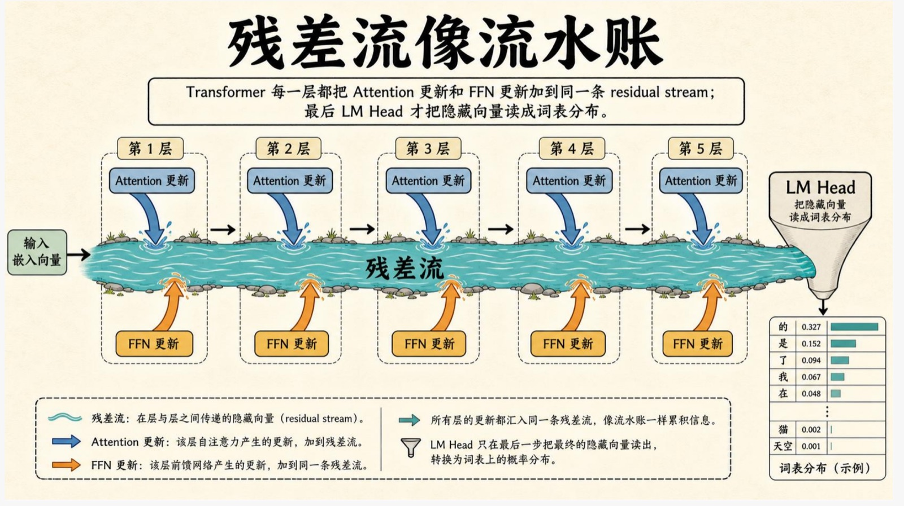
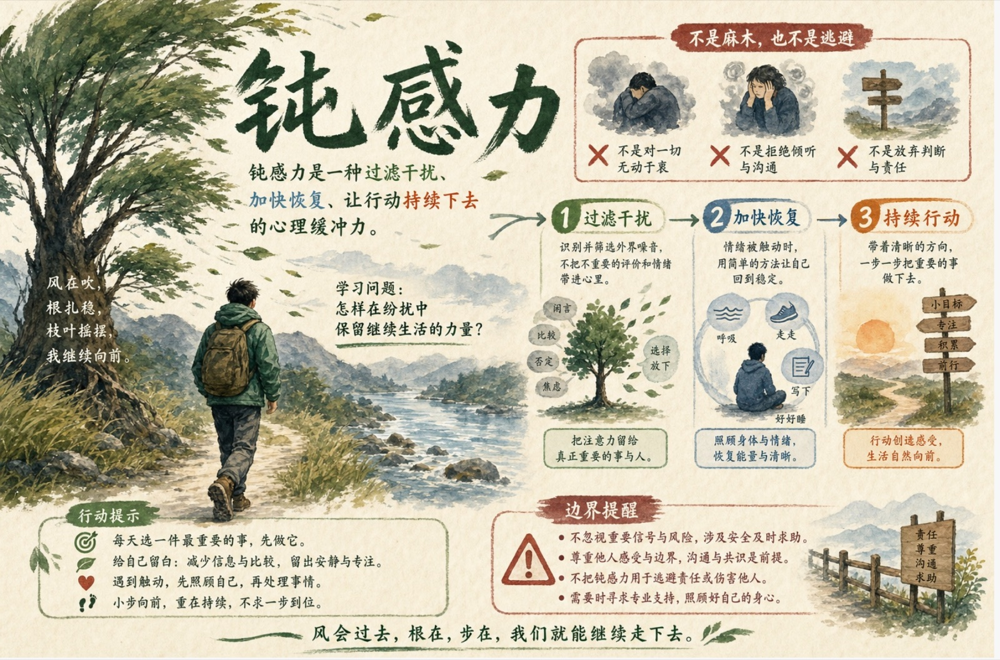

# Paper and Book to Visual Learning

> 把论文、书籍、文章等长文本，转化成可懂、看得清的视觉产品。

[](https://github.com/YIYANG-hakimide/paper-and-book-to-visual-learning/tags)
[](./SKILL.md)
[](./LICENSE)
[](https://yiyang-hakimide.github.io/paper-and-book-to-visual-learning/)

**Paper and Book to Visual Learning** 面向需要真正读懂长文本的人。它把论文、完整书籍、选定章节、文章、白皮书、研究报告和手册，整理成有清晰学习路径的视觉成品，同时保留关键概念、论证、证据与边界。

## 三种模式

- **图片（个人学习图册）**：把难点拆成连续、可独立阅读的讲解图，适合自学、复习与分享。可同时整理为按页浏览的 PDF 图册。
- **PPT（对外讲述，默认 PDF + 可编辑 PPTX）**：为汇报、教学和讨论组织完整叙事，让现场演示与会后阅读都能成立。**示例准备中。**
- **HTML（互动阅读器）**：把原文、中文导读、术语、图表和证据组织成可探索的阅读体验。**示例准备中。**

## 真实样例

### 论文视觉讲解

从机制到实验结果，视觉表达服务于理解，而不是替代证据。

**残差流像流水账**

[](assets/examples/paper-residual-stream.jpg)

**干预结果怎样读**

[](assets/examples/paper-intervention-results.jpg)

### 书籍视觉学习

把抽象观点落到可记忆的结构、例子和行动提示中。

**钝感力**

[](assets/examples/book-resilience.jpg)

**能睡着，是让大脑按时下班**

[](assets/examples/book-sleep-recovery.jpg)

## 安装与更新

推荐在 Codex 中使用：

```bash
git clone https://github.com/YIYANG-hakimide/paper-and-book-to-visual-learning.git \
  ~/.codex/skills/paper-and-book-to-visual-learning
```

已有本地版本时更新：

```bash
git -C ~/.codex/skills/paper-and-book-to-visual-learning pull --ff-only
```

其他支持 Skill 的智能体平台也可以使用本仓库；请按对应平台的 Skill 目录或仓库导入方式安装，并确保平台具有可用的生图能力。

## 使用

在已支持 Skill 的智能体环境中调用 `paper-and-book-to-visual-learning`，提供来源文件或链接，并选择一种主要输出。

```text
用 $paper-and-book-to-visual-learning 帮我把这本书做成图片（个人学习图册），其余全部默认。
```

```text
用 $paper-and-book-to-visual-learning 把这篇论文做成 PPT（对外讲述，默认 PDF + 可编辑 PPTX），详细模式。
```

```text
用 $paper-and-book-to-visual-learning 把这份研究报告做成 HTML（互动阅读器）。
```

## 图像能力

图片图册和视觉化演示需要可用的图像生成能力。Codex 环境推荐使用系统提供的 `imagegen`；其他智能体平台需要连接可用的生图模型。不同平台的模型、权限与文件返回方式可能不同。

## 支持的来源

- 学术论文、研究报告与白皮书
- 完整书籍、选定章节与长篇文章
- 手册、教程和其他结构化长文本
- 本地 PDF、文档或可访问的网页来源

## English

> Turn papers, books, articles, and other long-form sources into visual products that are easier to understand and see clearly.

**Paper and Book to Visual Learning** is for readers who want to understand a source rather than skim a summary. It transforms papers, full books, selected chapters, articles, white papers, reports, and manuals into guided visual outputs while preserving the concepts, argument, evidence, and boundaries that matter.

## Three Modes

- **Images (personal learning album)**: A coherent sequence of standalone teaching visuals for self-study, review, and sharing, with an optional page-matched PDF album.
- **PPT (present to others, PDF + editable PPTX by default)**: A complete narrative for presentations, teaching, and discussion that also remains useful when read afterward. **Examples coming soon.**
- **HTML (interactive reader)**: An explorable reading experience connecting source passages, guided explanations, terms, figures, and evidence. **Examples coming soon.**

## Examples

The four previews above show two different kinds of work: paper-focused mechanism and experiment explanation, and book-focused concept and action synthesis. Select any image to open the full-size preview.

## Install And Update

Recommended for Codex:

```bash
git clone https://github.com/YIYANG-hakimide/paper-and-book-to-visual-learning.git \
  ~/.codex/skills/paper-and-book-to-visual-learning
```

Update an existing checkout:

```bash
git -C ~/.codex/skills/paper-and-book-to-visual-learning pull --ff-only
```

Other Skill-compatible agent platforms can also use this repository. Install it through that platform's Skill-directory or repository-import workflow, and make sure the environment has a working image-generation capability.

## Usage

Call `paper-and-book-to-visual-learning` in a Skill-compatible agent environment, provide a source file or link, and choose one primary output.

```text
Use $paper-and-book-to-visual-learning to turn this book into Images (personal learning album). Use defaults for everything else.
```

```text
Use $paper-and-book-to-visual-learning to turn this paper into a detailed PPT (present to others, PDF + editable PPTX by default).
```

```text
Use $paper-and-book-to-visual-learning to turn this report into HTML (interactive reader).
```

## Image Capability

Image albums and visual presentations require an available image-generation capability. In Codex, the recommended route is the system `imagegen` capability. Other agent platforms need access to a capable image-generation model; model permissions and file-delivery behavior vary by platform.

## Supported Sources

- Academic papers, research reports, and white papers
- Full books, selected chapters, and long-form articles
- Manuals, tutorials, and other structured long-form texts
- Local PDFs, documents, or accessible web sources

## License

MIT. See [LICENSE](LICENSE).
